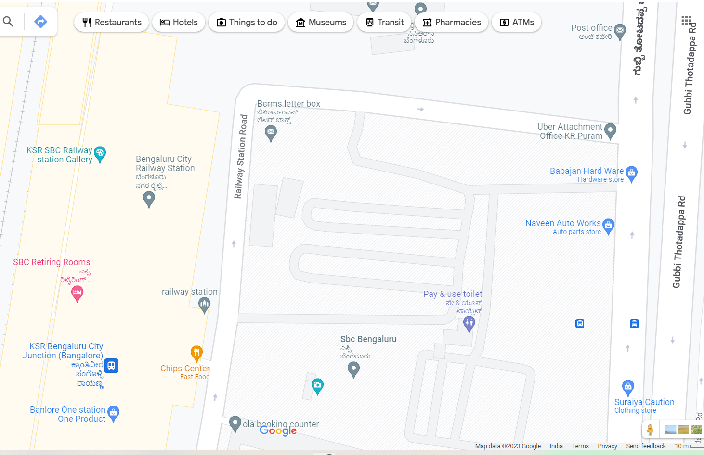
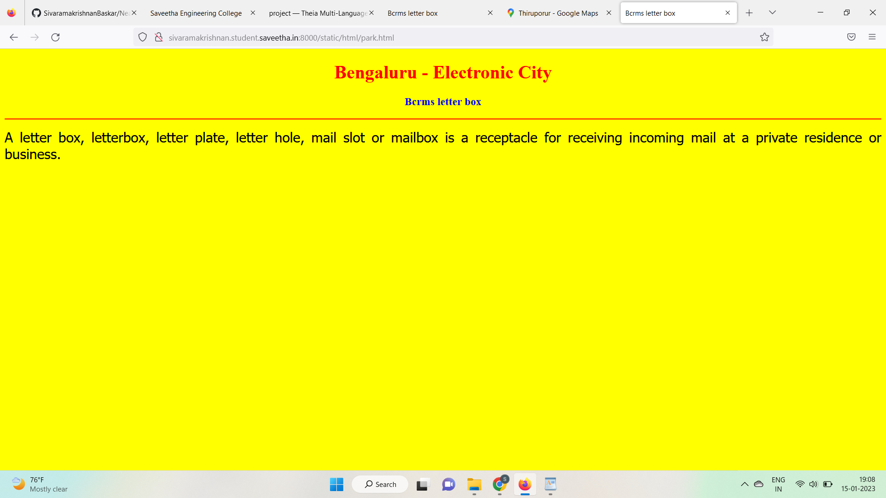
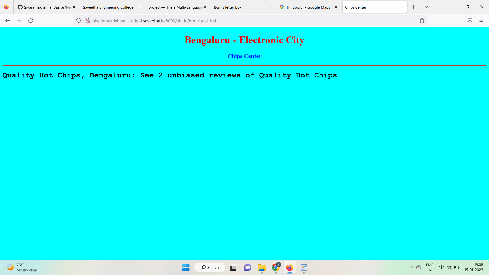
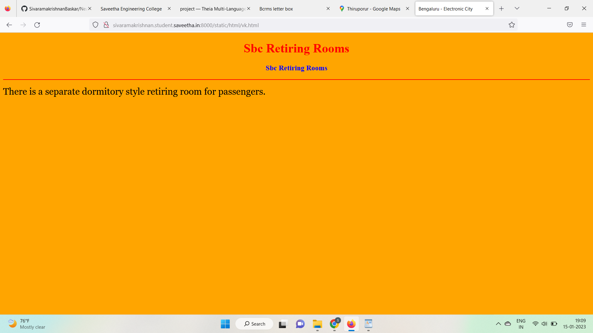
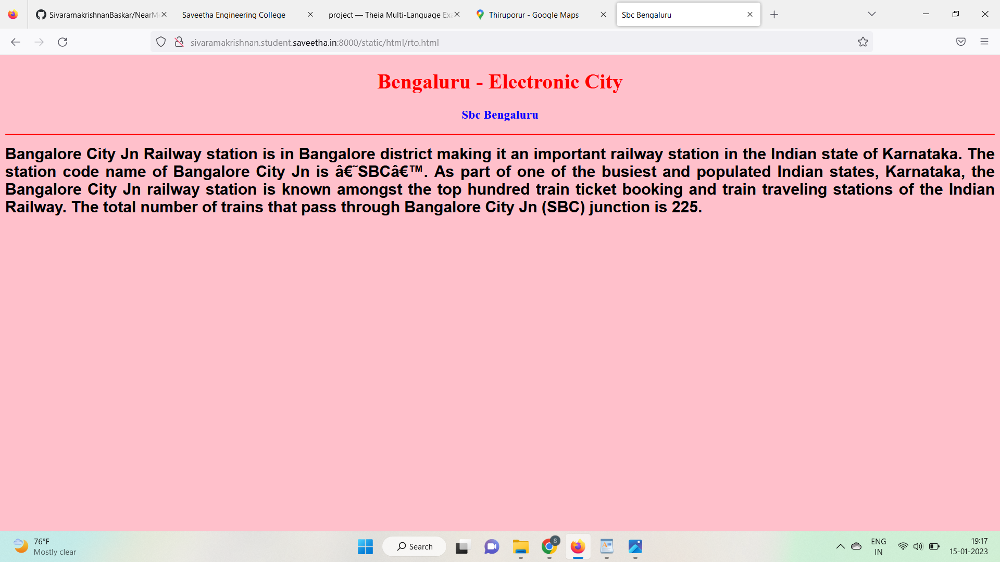
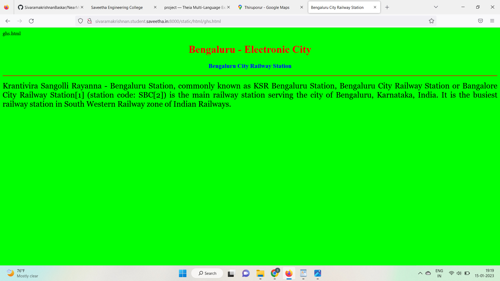
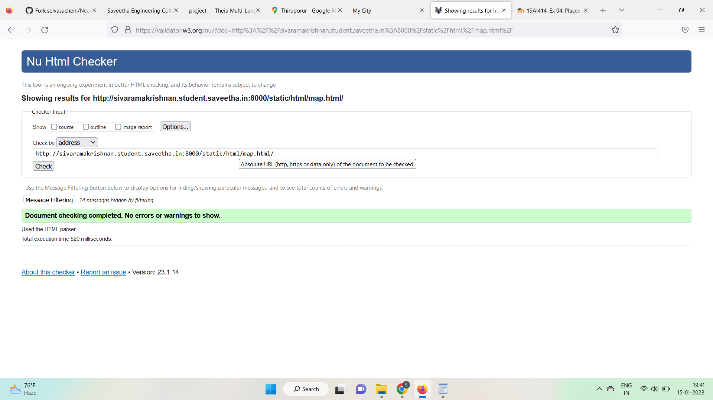

# Places Around Me
## AIM:
To develop a website to display details about the places around my house.

## Design Steps:

### Step 1:
Clone the github repository into Theia IDE.

### Step 2:
Create a new Django project

### Step 3:
Write the needed HTML code.

### Step 4:
Run the Django server and execute the HTML files.

## Code:
```
map.html
<!DOCTYPE html>
<html lang="en">
<head>
<title>My City</title>
</head>
<body>
<h1 align="center">
<font color="red"><b>Bengaluru - Electronic City </b></font>
</h1>
<h3 align="center">
<font color="blue"><b>Sivaramakrishnan B (22006798)</b></font>
</h3>
<center>

<map name="MyCity">
<area shape="circle" coords="190,50,20" href="/static/html/ghs.html" title="Bengaluru City Railway Station">
<area shape="rectangle" coords="230,30,260,60" href="/static/html/rto.html" title="Sbc Bengaluru">
<area shape="circle" coords="400,350,50" href="/static/html/vk.html" title="Sbc Retiring Rooms">
<area shape="circle" coords="400,200,75" href="/static/html/bus.html" title="Chips Center">
<area shape="rectangle" coords="490,150,870,320" href="/static/html/park.html" title="Bcrms letter box">
</map>
</center>
</body>
</html>

bus.html
<!DOCTYPE html>
<html lang="en">
<head>
<title>Chips Center</title>
</head>
<body bgcolor="cyan">
<h1 align="center">
<font color="red"><b>Bengaluru - Electronic City </b></font>
</h1>
<h3 align="center">
<font color="blue"><b>Chips Center</b></font>
</h3>
<hr size="3" color="red">
<p align="justify">
<font face="Courier New" size="5">
<b>
Quality Hot Chips, Bengaluru: See 2 unbiased reviews of Quality Hot Chips
</b>
</font>
</p>
</body>
</html>

park.html
<!DOCTYPE html>
<html lang="en">
<head>
<title>Bcrms letter box </title>
</head>
<body bgcolor="yellow">
<h1 align="center">
<font color="red"><b>Bengaluru - Electronic City </b></font>
</h1>
<h3 align="center">
<font color="blue"><b>Bcrms letter box </b></font>
</h3>
<hr size="3" color="red">
<p align="justify">
<font face="Tahoma" size="5">
A letter box, letterbox, letter plate, letter hole, mail slot or mailbox is a receptacle for receiving incoming mail at a private residence or business.
</font>
</p>
</body>
</html>

rto.html
<!DOCTYPE html>
<html lang="en">
<head>
<title>Sbc Bengaluru</title>
</head>
<body bgcolor="pink">
<h1 align="center">
<font color="red"><b>Bengaluru - Electronic City</b></font>
</h1>
<h3 align="center">
<font color="blue"><b>Sbc Bengaluru</b></font>
</h3>
<hr size="3" color="red">
<p align="justify">
<font face="Arial" size="5">
<b>
Bangalore City Jn Railway station is in Bangalore district making it an important railway station in the Indian state of Karnataka. The station code name of Bangalore City Jn is ‘SBC’. As part of one of the busiest and populated Indian states, Karnataka, the Bangalore City Jn railway station is known amongst the top hundred train ticket booking and train traveling stations of the Indian Railway. The total number of trains that pass through Bangalore City Jn (SBC) junction is 225.
</b>
</font>
</p>
</body>
</html>

ghs.html
<!DOCTYPE html>
<html lang="en">
<head>
<title>Bengaluru City Railway Station</title>
</head>
<body bgcolor="lime">
<h1 align="center">
<font color="red"><b>Bengaluru - Electronic City</b></font>
</h1>
<h3 align="center">
<font color="blue"><b>Bengaluru City Railway Station</b></font>
</h3>
<hr size="3" color="red">
<p align="justify">
<font face="Georgia" size="5">
Krantivira Sangolli Rayanna - Bengaluru Station, commonly known as KSR Bengaluru Station, Bengaluru City Railway Station or Bangalore City Railway Station[1] (station code: SBC[2]) is the main railway station serving the city of Bengaluru, Karnataka, India. It is the busiest railway station in South Western Railway zone of Indian Railways.
</font>
</p>
</body>
</html>

vk.html
<!DOCTYPE html>
<html lang="en">
<head>
<title>Bengaluru - Electronic City </title>
</head>
<body bgcolor="orange">
<h1 align="center">
<font color="red"><b>Sbc Retiring Rooms</b></font>
</h1>
<h3 align="center">
<font color="blue"><b>Sbc Retiring Rooms</b></font>
</h3>
<hr size="3" color="red">
<p align="justify">
<font face="Georgia" size="5">
There is a separate dormitory style retiring room for passengers.
</font>
</p>
</body>
</html>
```

## Output:












# HTML Validator


## Result:
The program for implementing image map is executed successfully